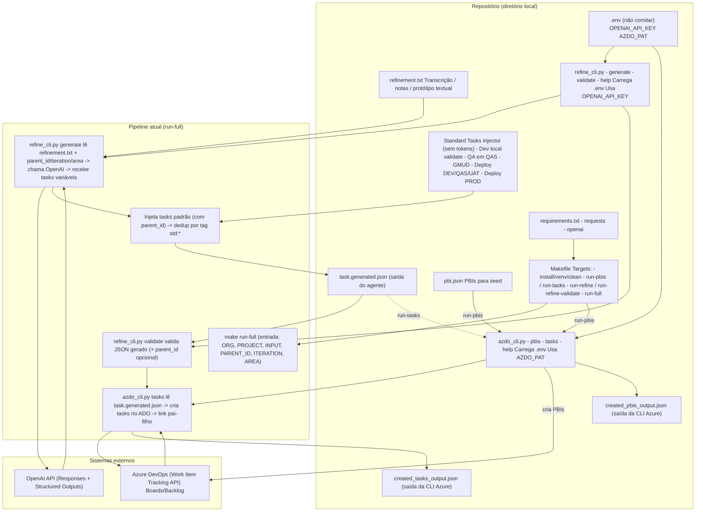

# Azure DevOps Backlog Automation — PBIs + Refinement Agent + Tasks Seeder

Este repositório contém duas CLIs em Python que automatizam o backlog no Azure DevOps:

1) **`azdo_cli.py`**: cria **PBIs** e **Tasks** diretamente no Azure DevOps Boards a partir de JSON.  
2) **`refine_cli.py`**: transforma um **refinamento técnico (texto/transcrição/protótipo textual)** em um **JSON de tasks** (pronto para o `azdo_cli.py`), usando OpenAI Responses API + Structured Outputs.

O objetivo é simples: **apenas o refinamento é manual**. Todo o resto — gerar tasks, validar e criar no board — é automatizado.

---

## Objetivo

- **Produtividade**: criar PBIs e Tasks em lote em segundos.
- **Padronização**: títulos, descrições, DoD, tags, iteração e área consistentes.
- **Reprodutibilidade**: backlog como “infra” — versionado em arquivos JSON no Git.
- **Menos erro humano**: evita esquecer campos e links pai-filho e reduz retrabalho.

---

## Visão geral do fluxo (recomendado)

### Fluxo A — Seed manual (JSON → Azure DevOps)
1. Escreva `pbi.json` → crie PBIs.
2. Pegue o `id` do PBI → escreva `task.json` com `parent_id`.
3. Crie as tasks no board.

### Fluxo B — Refinamento → Agente → JSON → Validação → Azure DevOps (automatizado)
1. Debate manual do refinamento → salva em `refinement.txt`.
2. `refine_cli.py` gera `task.generated.json`.
3. Valida o JSON.
4. `azdo_cli.py` cria as tasks no board.

> O target `make run-full` executa o Fluxo B do início ao fim.

---

## Requisitos

- Python **3.10+**
- Dependências Python (via `requirements.txt`):
  - `requests`
  - `openai`
- Azure DevOps:
  - **PAT** com permissão **Work Items (Read & write)**

---

## Configuração de ambiente (.env)

Você pode usar `.env` para não depender de `export` no shell.

Crie um arquivo `.env` (não comitar):

```env
OPENAI_API_KEY=coloque_sua_chave_aqui
AZDO_PAT=coloque_seu_pat_aqui
````

> Os scripts **carregam `.env`** antes de processar argumentos.

**Recomendação:** adicione `.env` ao `.gitignore`.

---

## Instalação (virtualenv)

```bash
make install
```

Isso cria `.venv` e instala `requirements.txt`.

---

## Makefile (comandos principais)

Veja todos os targets:

```bash
make help
```

### Seeds no Azure DevOps (JSON → Board)

**Criar PBIs:**

```bash
make run-pbis ORG=4le PROJECT=Lab FILE=./pbi.json
```

**Criar Tasks:**

```bash
make run-tasks ORG=4le PROJECT=Lab FILE=./task.json
```

### Agente de refinamento (TXT → JSON)

**Gerar tasks a partir do refinamento:**

```bash
make run-refine INPUT=./refinement.txt PARENT_ID=4 ITERATION='Lab\\Sprint 1' AREA=Lab OUT=./task.json
```

**Validar JSON de tasks:**

```bash
make run-refine-validate FILE=./task.json
```

### Pipeline completo (Refinamento → JSON → Validar → Criar no board)

Executa tudo em sequência:

```bash
make run-full ORG=4le PROJECT=Lab INPUT=./refinement.txt PARENT_ID=4 ITERATION='Lab\\Sprint 1' AREA=Lab
```

Você pode customizar saída e modelo:

```bash
make run-full ORG=4le PROJECT=Lab INPUT=./refinement.txt PARENT_ID=4 ITERATION='Lab\\Sprint 1' AREA=Lab OUT=./task.generated.json MODEL=gpt-4.1-nano
```

> **Model default do agente:** `gpt-4.1-nano` (bom custo/benefício para testes).

---

## Uso direto das CLIs (sem Makefile)

### azdo_cli.py

Ajuda:

```bash
python3 azdo_cli.py help
python3 azdo_cli.py help pbis
python3 azdo_cli.py help tasks
```

Criar PBIs:

```bash
python3 azdo_cli.py --org 4le --project Lab pbis --file ./pbi.json
```

Criar Tasks:

```bash
python3 azdo_cli.py --org 4le --project Lab tasks --file ./task.json
```

### refine_cli.py

Ajuda:

```bash
python3 refine_cli.py help
python3 refine_cli.py help generate
python3 refine_cli.py help validate
```

Gerar JSON:

```bash
python3 refine_cli.py generate \
  --input ./refinement.txt \
  --parent-id 4 \
  --iteration "Lab\\Sprint 1" \
  --area-path "Lab" \
  --out ./task.generated.json
```

Validar:

```bash
python3 refine_cli.py validate --file ./task.generated.json --parent-id 4
```

---

## Padrão do JSON — PBIs (`pbi.json`)

```json
{
  "pbis": [
    {
      "name": "string (obrigatório)",
      "description": "string (opcional)",
      "acceptance_criteria": ["string", "..."],
      "priority": 1,
      "effort": 5,
      "iteration": "Lab\\Sprint 1",
      "area_path": "Lab",
      "value_area": "Business",
      "state": "New",
      "tags": ["tag1", "tag2"],
      "key": "opcional (idempotência): ex. OAB-LOGIN-001"
    }
  ]
}
```

### Observação sobre `key` (idempotência)

Se você usar `key`, o `azdo_cli.py` grava `ext:<key>` em `System.Tags` e consegue evitar duplicar PBIs ao reexecutar.

---

## Padrão do JSON — Tasks (`task.json`)

```json
{
  "tasks": [
    {
      "parent_id": 123,
      "parent_url": "opcional (extrai ID de ?workitem=123 ou .../workItems/123)",
      "parent_key": "opcional (lookup por ext:<key> se você usar tags ext:)",

      "title": "string (recomendado)",
      "name": "string (fallback)",
      "description": "string (recomendado - texto rico)",
      "state": "To Do",
      "priority": 2,
      "remaining_work": 3,
      "assigned_to": "",
      "iteration": "Lab\\Sprint 1",
      "activity": "Development",
      "area_path": "Lab",
      "tags": ["setup", "environment"]
    }
  ]
}
```

### Resolução do PBI pai (azdo_cli.py)

O `azdo_cli.py` resolve o pai nesta ordem:

1. `parent_id` (preferido)
2. `parent_url` (extrai o ID)
3. `parent_key` (consulta WIQL por `ext:<key>`) — opcional

### Link pai-filho

A Task é criada com relation:

* `System.LinkTypes.Hierarchy-Reverse`

Isso coloca a task como **filha** do PBI.

---

## Refinamento: formato do input (`refinement.txt`)

O input pode ser:

* transcrição de call
* notas técnicas
* rascunho de protótipo textual

Recomendação: inclua

* objetivo
* decisões tomadas
* escopo / fora do escopo
* dependências
* riscos
* perguntas em aberto

Exemplo mínimo:

```text
Objetivo: Implementar autenticação com Azure AD (OIDC).
Decisões:
- login + callback
- sessão via cookie HttpOnly
- rate limit em /auth/*
Pendências:
- confirmar Redirect URI de produção
```

---

## Saída do agente (`refine_cli.py`)

O agente retorna um JSON com:

* `tasks[]` (compatível com `azdo_cli.py`)
* `meta` (auditoria)
* `assumptions[]` e `open_questions[]` (quando necessário)
* `sanitization.notes[]` (o que foi mascarado)

---

## Boas práticas e armadilhas

### 1) IterationPath e AreaPath precisam existir

Se você usar:

* `Lab\\Sprint 1`
* `Lab`
  Esses paths devem existir no Azure DevOps, senão falha.

### 2) Campos variam por processo

Alguns campos (ex.: AcceptanceCriteria) dependem do template/processo do Azure DevOps.

### 3) Não comite segredos

* `.env` deve estar no `.gitignore`
* nunca comite `AZDO_PAT` ou `OPENAI_API_KEY`

### 4) Quality gate do agente

O `refine_cli.py validate` existe para evitar mandar lixo ao Azure DevOps.
Use sempre antes de `azdo_cli.py tasks` (o `run-full` já faz isso).

---

## Licença

MIT

---

### Diagramas

Diagrama de componentes e suas conexões



## Diagrama de Sequência

Sequência de execução dos processos

```

sequenceDiagram
  autonumber
  actor TL as Tech Lead / PO
  participant TXT as refinement.txt (input)
  participant RF as refine_cli.py (generate)
  participant SAN as Sanitizer (.env + PII/segredos)
  participant OAI as OpenAI API (Responses + Structured Outputs)
  participant STD as Standard Tasks Injector (sem tokens)
  participant OUT as task.generated.json
  participant VAL as refine_cli.py (validate)
  participant AZ as azdo_cli.py (tasks)
  participant ADO as Azure DevOps (WIT API)
  participant AUD as created_tasks_output.json

  TL->>TXT: Escreve/refina o texto do refinamento (manual)
  TL->>RF: Executa make run-full / refine_cli.py generate\n(parent_id, iteration, area)
  RF->>SAN: Carrega .env (OPENAI_API_KEY) + sanitiza input
  SAN-->>RF: Texto sanitizado + sanitization.notes
  RF->>OAI: Envia prompt + JSON Schema (strict)\n(gera apenas tasks variáveis)
  OAI-->>RF: JSON com tasks variáveis (conforme schema)
  RF->>STD: Injeta tasks padrão (QA, Dev local, GMUD, deploys)\nsem consumir tokens
  STD-->>RF: Payload completo (variáveis + padrão)\n(dedup por tag std:*)
  RF->>OUT: Salva task.generated.json

  TL->>VAL: Executa refine_cli.py validate --file task.generated.json
  VAL->>OUT: Lê task.generated.json
  VAL-->>TL: OK (ou erro + motivo)

  TL->>AZ: Executa azdo_cli.py tasks --file task.generated.json\n(org, project)
  AZ->>ADO: Para cada task: POST Work Item (Task)\n+ relation Hierarchy-Reverse(parent_id)
  ADO-->>AZ: Retorna IDs das tasks criadas
  AZ->>AUD: Salva created_tasks_output.json
  AZ-->>TL: Confirma tasks criadas e linkadas ao PBI

```

