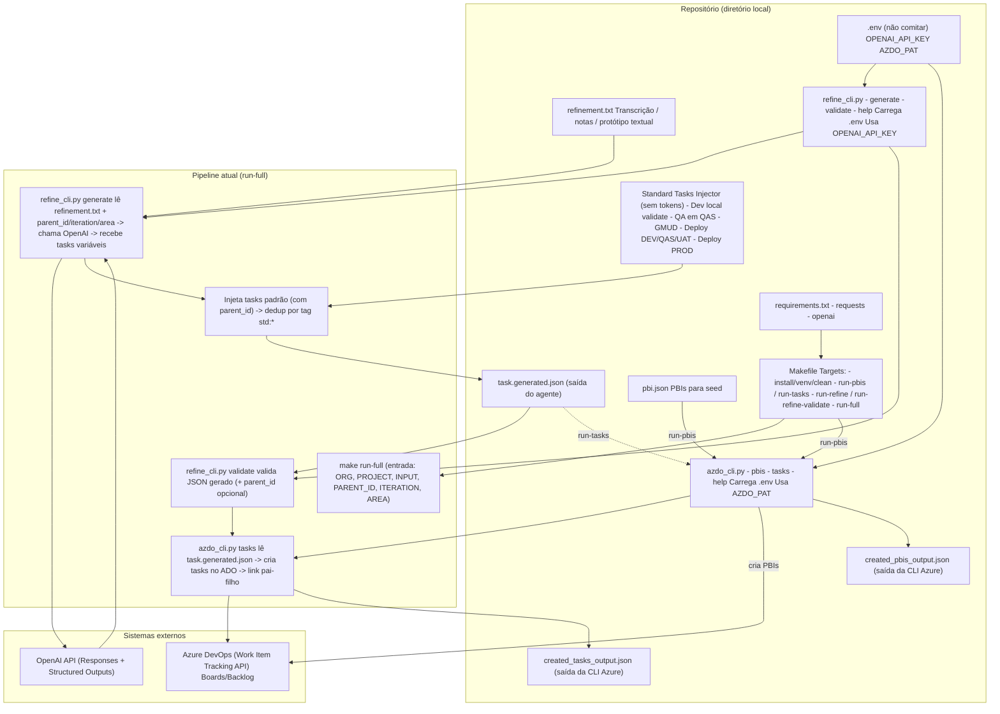
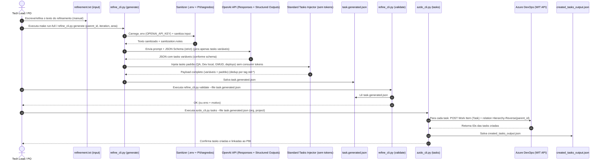

# Azure DevOps Automation — PBIs + Refinement Agent + Tasks Seeder

Este repositório contém duas CLIs em Python para automatizar backlog no Azure DevOps Boards:

1) **`azdo_cli.py`**: cria **PBIs** e **Tasks** no Azure DevOps a partir de JSON.  
2) **`refine_cli.py`**: transforma um **refinamento técnico (texto/transcrição/protótipo textual)** em um **JSON de tasks** pronto para o `azdo_cli.py`, usando **OpenAI Responses API + Structured Outputs**.

Objetivo prático: **o único passo humano é escrever/refinar o texto**. O restante — gerar tasks, validar e criar no board — é automatizado.

---

## Objetivo

- **Produtividade**: criar PBIs e Tasks em lote rapidamente.
- **Padronização**: títulos, descrições, DoD, tags, iteração e área consistentes.
- **Reprodutibilidade**: backlog como “infra” versionado em JSON.
- **Menos erro humano**: reduz falhas de vínculo pai-filho e campos esquecidos.

---

## Documentação

A documentação completa está em `docs/`:

- **Quickstart**: `docs/quickstart.md`
- **CLI azdo_cli**: `docs/cli/azdo_cli.md`
- **CLI refine_cli**: `docs/cli/refine_cli.md`
- **Formatos JSON**: `docs/formats/pbi_json.md` e `docs/formats/task_json.md`
- **Segurança e privacidade**: `docs/security-privacy.md`
- **Troubleshooting**: `docs/troubleshooting.md`
- **FAQ**: `docs/faq.md`

---

## Visão geral do fluxo

### Fluxo A — Seed manual (JSON → Azure DevOps)

1. Escreva `pbi.json` → crie PBIs.
2. Pegue o `id` do PBI → escreva `task.json` com `parent_id`.
3. Crie as tasks no board.

### Fluxo B — Refinamento → Agente → JSON → Validação → Azure DevOps (automatizado)

1. Debate manual do refinamento → salva em `refinement.txt`.
2. `refine_cli.py generate` gera `task.generated.json`.
3. `refine_cli.py validate` valida o JSON.
4. `azdo_cli.py tasks` cria as tasks no board.

> O target `make run-full` executa o Fluxo B do início ao fim.

---

## Requisitos

- Python **3.10+**
- Dependências Python (via `requirements.txt`):
  - `requests`
  - `openai`
- Azure DevOps:
  - **PAT** com permissão **Work Items (Read & write)**

---

## Configuração de ambiente (.env)

Crie um arquivo `.env` (não comitar):

```env
OPENAI_API_KEY=coloque_sua_chave_aqui
AZDO_PAT=coloque_seu_pat_aqui
```

> As duas CLIs carregam `.env` na inicialização.

---

## Instalação (virtualenv)

```bash
make install
```

Cria `.venv` e instala `requirements.txt`.

---

## Makefile (comandos principais)

Ver todos os targets:

```bash
make help
```

### Help das CLIs

```bash
make run-help
make run-help-azdo
make run-help-refine
```

### Seeds no Azure DevOps (JSON → Board)

**Criar PBIs:**

```bash
make run-pbis ORG=4le PROJECT=Lab FILE=./data/pbi.json
```

**Criar Tasks:**

```bash
make run-tasks ORG=4le PROJECT=Lab FILE=./data/task.json
```

### Agente de refinamento (TXT → JSON)

**Gerar tasks a partir do refinamento:**

```bash
make run-refine INPUT=./data/refinement.txt PARENT_ID=4 ITERATION='Lab\\Sprint 1' AREA=Lab OUT=./data/task.json
```

**Validar JSON de tasks:**

```bash
make run-refine-validate FILE=./data/task.json PARENT_ID=4
```

### Pipeline completo (Refinamento → JSON → Validar → Criar no board)

```bash
make run-full ORG=4le PROJECT=Lab INPUT=./data/refinement.txt PARENT_ID=4 ITERATION='Lab\\Sprint 1' AREA=Lab
```

Customizando saída e modelo:

```bash
make run-full ORG=4le PROJECT=Lab INPUT=./data/refinement.txt PARENT_ID=4 ITERATION='Lab\\Sprint 1' AREA=Lab OUT=./data/task.generated.json MODEL=gpt-4.1-nano
```

> **Model default do agente:** `gpt-4.1-nano`.

---

## Loading no terminal (opcional)

As CLIs podem mostrar progresso (stdout fica “limpo”; loading sai em stderr).

Desligar:

```bash
AZDO_PROGRESS=0 REFINE_PROGRESS=0 make run-full ...
```

---

## Uso direto das CLIs (sem Makefile)

### azdo_cli.py

Ajuda:

```bash
python3 azdo_cli.py help
python3 azdo_cli.py help pbis
python3 azdo_cli.py help tasks
```

Criar PBIs:

```bash
python3 azdo_cli.py --org 4le --project Lab pbis --file ./data/pbi.json
```

Criar Tasks:

```bash
python3 azdo_cli.py --org 4le --project Lab tasks --file ./data/task.json
```

### refine_cli.py

Ajuda:

```bash
python3 refine_cli.py help
python3 refine_cli.py help generate
python3 refine_cli.py help validate
```

Gerar JSON:

```bash
python3 refine_cli.py generate \
  --input ./data/refinement.txt \
  --parent-id 4 \
  --iteration "Lab\\Sprint 1" \
  --area-path "Lab" \
  --out ./data/task.generated.json
```

Validar:

```bash
python3 refine_cli.py validate --file ./data/task.generated.json --parent-id 4
```

---

## Padrão do JSON — PBIs (`pbi.json`)

```json
{
  "pbis": [
    {
      "name": "string (obrigatório)",
      "description": "string (opcional)",
      "acceptance_criteria": ["string", "..."],
      "priority": 1,
      "effort": 5,
      "iteration": "Lab\\Sprint 1",
      "area_path": "Lab",
      "value_area": "Business",
      "state": "New",
      "tags": ["tag1", "tag2"],
      "key": "opcional (idempotência): ex. OAB-LOGIN-001"
    }
  ]
}
```

### Observação sobre `key` (idempotência)

Se você usar `key`, o `azdo_cli.py` grava `ext:<key>` em `System.Tags` e consegue evitar duplicar PBIs ao reexecutar (quando `--allow-duplicates` não é usado).

---

## Padrão do JSON — Tasks (`task.json`)

```json
{
  "tasks": [
    {
      "parent_id": 123,
      "parent_url": "opcional (extrai ID de ?workitem=123 ou .../workItems/123)",
      "parent_key": "opcional (lookup por ext:<key> se você usar tags ext:)",
      "title": "string (recomendado)",
      "name": "string (fallback)",
      "description": "string (recomendado - texto rico)",
      "state": "To Do",
      "priority": 2,
      "remaining_work": 3,
      "assigned_to": null,
      "iteration": "Lab\\Sprint 1",
      "activity": "Development",
      "area_path": "Lab",
      "tags": ["setup", "environment"]
    }
  ]
}
```

### Resolução do PBI pai (azdo_cli.py)

Ordem de resolução:

1. `parent_id` (preferido)
2. `parent_url` (extrai o ID)
3. `parent_key` (consulta WIQL por `ext:<key>`) — opcional

### Link pai-filho

A Task é criada com relation:

* `System.LinkTypes.Hierarchy-Reverse`

Isso coloca a task como **filha** do PBI.

---

## Refinamento: formato do input (`refinement.txt`)

O input pode ser:

* transcrição de call
* notas técnicas
* rascunho de protótipo textual

Recomendação: inclua

* objetivo
* decisões tomadas
* escopo / fora do escopo
* dependências
* riscos
* perguntas em aberto

Exemplo mínimo:

```text
Objetivo: Implementar autenticação com Azure AD (OIDC).
Decisões:
- login + callback
- sessão via cookie HttpOnly
- rate limit em /auth/*
Pendências:
- confirmar Redirect URI de produção
```

---

## Saída do agente (`refine_cli.py`)

O agente retorna um JSON com:

* `tasks[]` (compatível com `azdo_cli.py`)
* `meta` (auditoria)
* `assumptions[]` e `open_questions[]` (quando necessário)
* `sanitization.notes[]` (o que foi mascarado)

Além disso, o script injeta tasks padrão (`std:*`) para consistência de processo.

---

## Boas práticas e armadilhas

### 1) IterationPath e AreaPath precisam existir

Se você usar:

* `Lab\\Sprint 1`
* `Lab`

Esses paths devem existir no Azure DevOps, senão falha.

### 2) Campos variam por processo

Alguns campos dependem do template/processo do Azure DevOps (ex.: Acceptance Criteria).

### 3) Não comite segredos

* `.env` deve estar no `.gitignore`
* nunca comite `AZDO_PAT` ou `OPENAI_API_KEY`

### 4) Quality gate do agente

Use `refine_cli.py validate` antes de `azdo_cli.py tasks`.
O `run-full` já faz isso.

---

## Licença

MIT

---

## Diagramas

### Diagrama de componentes



### Diagrama de sequência


