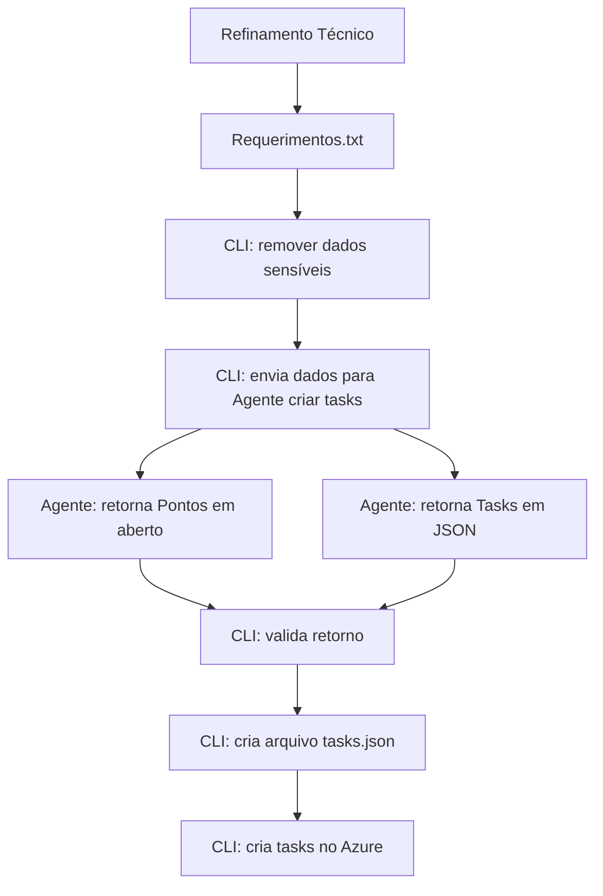

## Proposta para Gestão: Automatizar criação de Tasks no Azure Boards (CLI + Agente)

### 1) Objetivo

Reduzir tempo e custo recorrente gasto em reuniões de “criação manual de tasks”, concentrando esforço humano onde ele gera mais valor (refinamento técnico e clareza de requisitos), e automatizando a etapa operacional (gerar tasks padronizadas + criar no Azure Boards).

---

## 2) Problema (estado atual)

**Como é hoje**

* Desenvolvedores ficam em reunião para escrever tasks manualmente no Azure Boards.
* Duração média: **30 minutos**.
* Participantes típicos: **3 desenvolvedores + 1 tech lead** (4 pessoas).
* Frequência recorrente (há dias com reunião, há dias sem). E mesmo quando ocorre, **nem todos contribuem** — mas todos pagam o custo do tempo.

**Por que isso é um desperdício**

* Reunião operacional repetitiva → alto custo e baixo retorno marginal.
* Context switching e interrupções diárias impactam produtividade real.
* O output (tasks) depende muito de quem “puxa” a reunião — qualidade varia e há risco de inconsistência.

---

## 3) Solução proposta (estado futuro)

**Premissa central:** esforço humano vai para **refinamento** (qualidade), e o resto vira **execução automatizada** (velocidade + padronização).

### Fluxo proposto

1. **Refinamento Técnico** gera um `Requerimentos.txt` rico (objetivo, contexto, regras, critérios de aceite, riscos, dependências).
2. **CLI** remove/mascara dados sensíveis (PII/segredos).
3. **CLI** envia o conteúdo para um **Agente** gerar tasks.
4. **Agente** retorna:

   * **Pontos em aberto** (perguntas e lacunas)
   * **Tasks em JSON** (estrutura padronizada)
5. **CLI** valida o JSON (schema + campos obrigatórios).
6. **CLI** cria `tasks.json` versionável.
7. **CLI** cria as tasks no **Azure Boards**.

**Resultado esperado:** reduzir o ciclo “criar tasks” de **30 min → 5 min** (revisão rápida + execução), mantendo rigor via validação e padronização.

---

## 4) Estimativa de economia anual

### Premissas

* Participantes por sessão: **4 pessoas**
* Tempo antes: **30 min**
* Tempo depois: **5 min**
* **Tempo economizado por sessão:** 25 min = **0,4167 h**
* Frequência: **3 dias por semana**, durante o ano
  → 3 × 52 = **156 sessões/ano**
* Salário médio dev: **R$ 8.000/mês**
* Custo empresa (encargos): **+50%**
  → custo carregado: **R$ 12.000/mês por pessoa**
* **Custo de execução da CLI:** R$ **0,10** por execução

### Conversão para custo/hora 

Para estimar custo/hora, usei **160h/mês** (40h/semana).

* Custo/hora por pessoa = 12.000 / 160 = **R$ 75/h**

> Se sua empresa usar 176h ou 220h/mês, o valor/hora cai. Abaixo eu deixo a fórmula para recalcular facilmente.

### Cálculo

* Horas economizadas por sessão (grupo)
  = 4 pessoas × 0,4167 h = **1,6668 h**
* Economia por sessão
  = 1,6668 × 75 = **R$ 125,01** (≈ R$ 125)
* Economia anual (tempo)
  = 156 × 125 = **R$ 19.500**
* Custo anual de execução da CLI
  = 156 × 0,10 = **R$ 15,60**
* **Economia anual líquida estimada:** **≈ R$ 19.484**

### O que esse número representa (importante)

* Isso é **apenas custo direto do tempo de reunião**.
* Não inclui ganhos indiretos (menos interrupções, mais foco, menos retrabalho, melhor rastreabilidade), que normalmente são relevantes.

**Fórmula para recalcular com parâmetros reais**

* `CustoHora = (Salario * 1.5) / HorasMes`
* `EconomiaSessao = Pessoas * ((TempoAntes - TempoDepois)/60) * CustoHora`
* `EconomiaAnual = EconomiaSessao * SessoesAno - (CustoCLI * SessoesAno)`

---

## 5) Pontos fortes (benefícios)

### Benefícios financeiros e operacionais

* **Redução de custo recorrente** (tempo de 4 pessoas).
* **Menos dependência de reunião síncrona**: libera agenda e reduz gargalo.
* **Repetibilidade**: mesma estrutura de tasks sempre (títulos, descrição, DoD, links, tags).
* **Velocidade**: gera tasks em minutos; time passa a executar mais rápido.

### Benefícios de qualidade

* **Força o refinamento a ser melhor** (documento rico vira a “fonte de verdade”).
* **Pontos em aberto explícitos**: o agente devolve lacunas; isso melhora requisito e reduz retrabalho.
* **Auditabilidade**: `Requerimentos.txt` + `tasks.json` versionados → rastreabilidade do porquê cada task existe.

---

## 6) Pontos fracos (custos, riscos e trade-offs)

### Riscos reais

1. **Garbage in, garbage out**: refinamento ruim → tasks ruins, só mais rápido.
2. **Risco de “alucinação”/inferência errada do agente**: pode criar tasks que parecem plausíveis, mas não refletem o contexto real.
3. **Perda de alinhamento social**: algumas reuniões existem para sincronizar entendimento; automatizar pode reduzir troca de contexto.
4. **Segurança e compliance**: mesmo com redaction, ainda existe risco de vazar informação sensível se o filtro for fraco.
5. **Overhead de manutenção**: schema, validações, templates, evolução do prompt/agente e ajustes com o tempo.

### Custos indiretos

* Treinar o time a produzir `Requerimentos.txt` bem feito.
* Definir padrão de DoD, tags e estrutura de tasks.
* Implementar governança mínima (quem aprova, como versiona, como mede qualidade).

---

## 7) Mitigações recomendadas (para tornar a proposta “apresentável” e segura)

**Controle de qualidade**

* **Modo “dry-run”** no início: gerar `tasks.json` sem criar no Azure, só para comparar com o manual.
* **Validação forte (schema + regras)**: campos obrigatórios, tamanho mínimo, proibição de strings perigosas, etc.
* **Revisão humana curta e objetiva (5 min)** antes do “create”: aprovar ou ajustar.

**Segurança**

* Redaction local obrigatório (PII, tokens, segredos, URLs internas sensíveis).
* Log sanitizado (sem payload completo).
* Lista do que pode/não pode sair do ambiente (data minimization).
* Se aplicável: usar solução corporativa/contrato adequado para processamento de dados.

**Alinhamento**

* Manter 1 checkpoint semanal curto (15 min) para alinhar padrões, não para “digitar tasks”.

---

## 8) Plano de implementação (enxuto, com prova de valor)

**Fase 1 — Piloto (2–3 semanas)**

* Time piloto com 1–2 squads.
* Rodar em paralelo: manual vs agente (comparar qualidade e tempo).
* Medir:

  * tempo por sessão (antes/depois),
  * retrabalho por task (reabertura, falta de info),
  * satisfação do time,
  * aderência ao padrão (DoD, tags, links).

**Fase 2 — Padronização**

* Congelar template do `Requerimentos.txt`
* Congelar schema do `tasks.json`
* Checklist de segurança (redaction)

**Fase 3 — Escala**

* Expandir para outras squads
* Criar rotina de melhoria contínua baseada em métricas

---

## 9) Decisão solicitada à gestão

1. Aprovação para **piloto controlado** (sem risco operacional alto).
2. Definir um **sponsor** (gestor responsável) e um **time piloto**.
3. Acordar métricas de sucesso:

   * redução de tempo por sessão,
   * qualidade de tasks,
   * redução de retrabalho.

---

## 10) Conclusão direta

A proposta é forte porque ataca um desperdício recorrente com impacto mensurável: **tempo de 4 pessoas em tarefa operacional repetitiva**. Mesmo numa estimativa conservadora, o ganho anual direto fica em torno de **~R$ 19,5 mil/ano** apenas em tempo de reunião (sem contar ganhos indiretos).
O risco principal não é técnico; é **governança + qualidade do refinamento + segurança**. Com validação, revisão curta e piloto, é uma aposta racional.

## Apresentação da Solução

Clique na imagem abaixo para reproduzir o vídeo

